# Hermes II Avionics Redesign

Semester project completed with the EPFL Rocket Team in 2022.

Hermes II is a compact avionics architecture developed for a small experimental rocket intended for validation flights and data generation. The project focused on redesigning the electronics of the original Hermes platform into a smaller, more modular system with telemetry, GPS, multiple sensor boards, and improved integration inside the rocket.

## Project summary

The avionics stack is built around one main PCB and three auxiliary PCBs placed in different parts of the rocket:

- **Main PCB** in the avionics bay
- **Nosecone PCB** for total pressure and wall temperature
- **Static port PCB** for static pressure and wall temperature
- **Load cell PCB** for thrust measurement signal conditioning

The design integrates:
- Teensy 3.5 microcontroller
- GPS
- XBee telemetry
- IMU and accelerometer
- pressure sensors
- thermocouple interfaces
- load cell instrumentation amplifier
- battery management and power regulation

## System overview

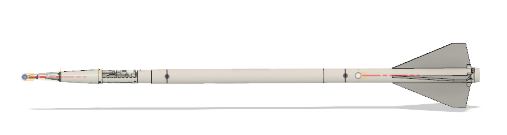

**Source in repository:** `docs/Hermes_Presentation.pptx`

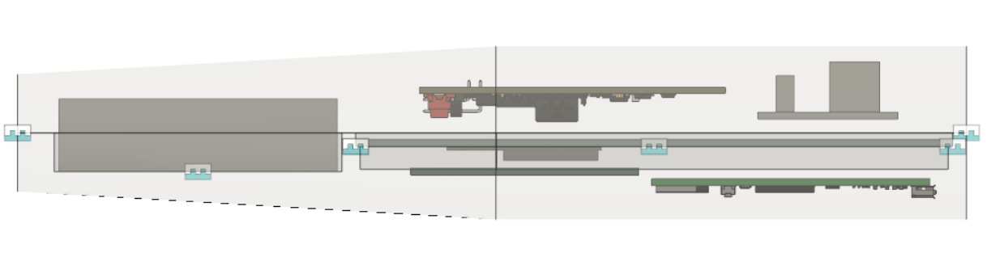


## Main PCB

The main board had to fit inside a very constrained avionics bay while interfacing with the GPS, telemetry radio, IMU, pressure sensors, thermocouples, Altimax, Wildhorn sensor board, and auxiliary boards. It uses a 4-layer stack-up with dedicated ground and power planes.

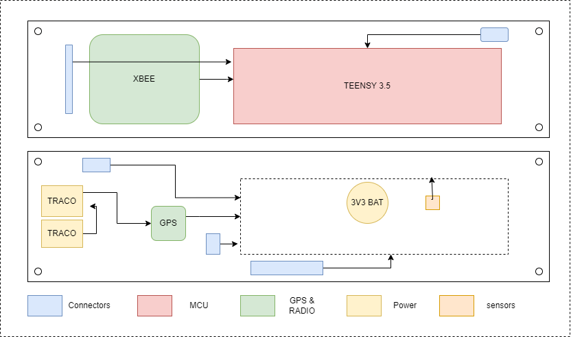


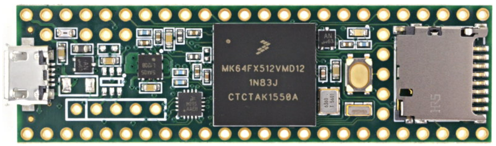


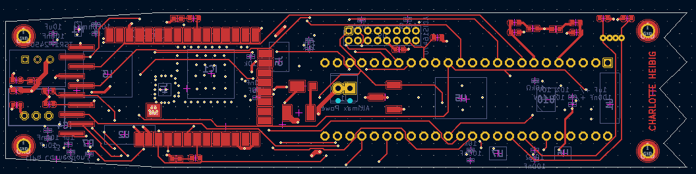


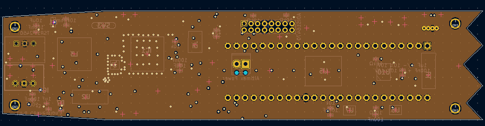


## GPS layout constraints

One of the most layout-sensitive parts of the board was the GPS section, especially antenna routing and the controlled-impedance microstrip connection.

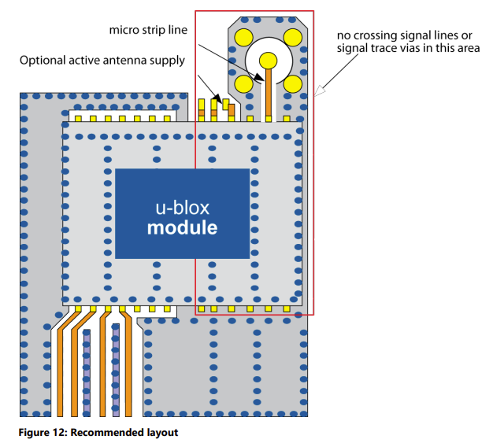


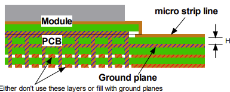


## Auxiliary PCBs

### Nosecone PCB
Measures total pressure and wall temperature.

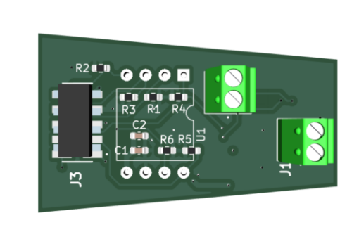


### Static port PCB
Measures static pressure and wall temperature.

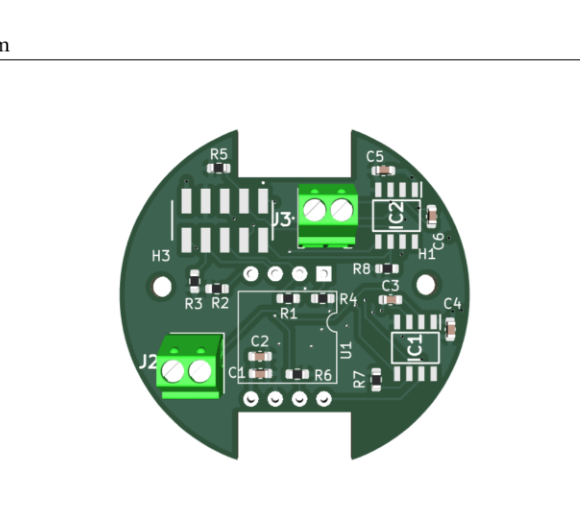


### Load cell PCB
Conditions the load cell signal used for thrust measurement.

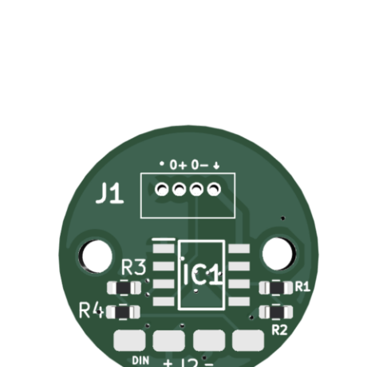


## Main technical points

- Compact avionics redesign for a constrained rocket airframe
- Separation of avionics into one main PCB and three auxiliary PCBs
- Integration of telemetry and GPS
- Pressure, temperature, acceleration, and inertial sensing
- Load cell instrumentation for thrust measurements
- 4-layer PCB design under mechanical, thermal, and routing constraints
- Manufacturing through a combination of external PCB assembly and manual soldering

## Results

According to the final presentation, the following subsystems were functional during project testing:

- GPS worked outdoors
- telemetry radio worked
- thermocouples worked
- pressure sensors, IMU, and Altimax were functional
- the accelerometer worked after replacing a faulty capacitor

Main issues and remaining work included:

- power supply malfunction
- some MAX31855 thermocouple interfaces failed
- connector orientation errors that were later corrected
- remaining validation work for the load cell amplifier and some Wildhorn sensor software

See slides **“RESULTATS”** and **“CONCLUSION”** in `docs/Hermes_Presentation.pptx`.

## Repository structure

```text
Hermes-II-GitHub/
├── README.md
├── .gitignore
├── docs/
│   ├── Hermes_Presentation.pptx
│   └── report.pdf
├── images/
│   ├── rocket_overview.png
│   ├── avionics_bay.png
│   ├── system_block_diagram.png
│   ├── main_pcb_top.png
│   ├── main_pcb_bottom.png
│   ├── main_pcb_signal_routing.png
│   ├── main_pcb_power_planes.png
│   ├── gps_layout_guidelines.png
│   ├── gps_microstrip_stackup.png
│   ├── nosecone_board.png
│   ├── static_port_board.png
│   └── load_cell_board.png
└── hardware/
    ├── main_pcb/
    ├── nosecone_pcb/
    ├── static_port_pcb/
    └── load_cell_pcb/
```

## Opening the hardware files

The hardware design files are provided in KiCad project format. Open the corresponding `.kicad_pro` file in each hardware subfolder.

## Notes on cleanup

The original archive contained backup folders, duplicate copies, cache files, autosaves, nested zip archives, and other user-specific artifacts. Those were removed here so the repository is cleaner and more appropriate for direct GitHub upload, while keeping the design files, local libraries, 3D assets, and fabrication outputs.
